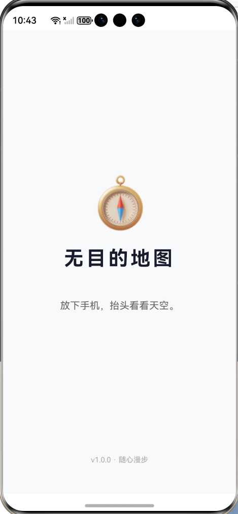
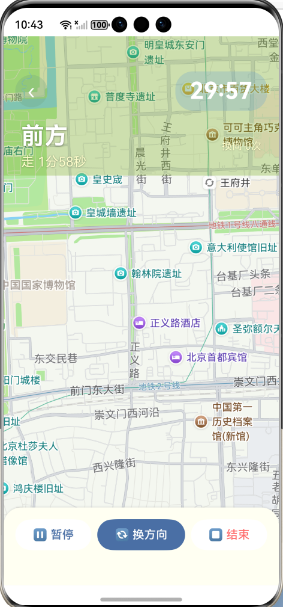

# 无目的地图

> 放下导航，让随机指引带你发现城市中被忽略的角落。

一款 HarmonyOS 原生应用，为你的漫步赋予"无目的"的意义。选择时长，跟随随机方向行走，在地图上留下只属于你的轨迹。

## 功能概览

**随机漫步引导** — 选择 5/15/30/45/60 分钟的漫步时长，应用随机生成方位角、距离和行走时间，转换为前后左右的方向指引。每段路程结束后自动切换新方向，也可以手动换向。

**实时地图追踪** — 集成华为 MapKit，全屏地图显示当前位置、随机目标点标记和行走轨迹，地图随位置实时移动。

**白噪音陪伴** — 内置雨声、海浪、森林、风声四种白噪音，也支持从本地选择自定义音频文件，循环播放，音量固定为 0.5。

**漫步记录** — 结束后可记录感受文字、添加最多 3 张照片，保存到本地。历史记录支持查看详情、照片全屏预览、删除和分享卡片。

**多端响应式布局** — 基于自定义断点系统（xs/sm/md/lg），适配手机、平板和 2in1 设备，卡片、字号、间距均随屏幕尺寸自动调整。

**跨设备流转** — 支持 HarmonyOS 自由流转，漫步状态（倒计时、位置、轨迹、音频）可在设备间无缝迁移。

## 用户流程

```
启动页（随机引言）
    ↓
首页（选择时长 → 开始漫步）
    ↓
漫步页（地图 + 方向指引 + 倒计时 + 白噪音）
    ↓
总结页（查看统计 → 记录感受 → 添加照片 → 保存）
    ↓
返回首页 / 查看历史记录
```

## 项目结构

```
aimlessmap5/
├── AppScope/                        # 应用级资源（图标、名称）
├── entry/
│   └── src/main/
│       ├── ets/
│       │   ├── constants/           # 常量与配置
│       │   │   ├── AppConstants.ets     # 应用参数（距离范围、计时器选项等）
│       │   │   ├── BreakpointConstants.ets  # 响应式断点阈值与工具类
│       │   │   ├── QuoteConstants.ets    # 随机引言语料库
│       │   │   └── ThemeConstants.ets    # 统一设计令牌（颜色、圆角、阴影）
│       │   ├── model/
│       │   │   └── WalkRecord.ets        # 漫步记录数据模型
│       │   ├── pages/               # 页面
│       │   │   ├── SplashPage.ets        # 启动页
│       │   │   ├── HomePage.ets          # 首页（时长选择、统计、开始）
│       │   │   ├── WalkPage.ets          # 漫步页（地图、方向、控制）
│       │   │   ├── WalkSummaryPage.ets   # 总结页（统计、感受、照片）
│       │   │   ├── RecordPage.ets        # 记录列表页
│       │   │   └── SettingsPage.ets      # 设置页（白噪音、关于）
│       │   ├── service/              # 服务层
│       │   │   ├── LocationService.ets   # GPS 定位服务
│       │   │   ├── RandomService.ets     # 随机方向与距离生成
│       │   │   ├── AudioService.ets      # 音频播放服务
│       │   │   └── ContinueService.ets   # 跨设备流转服务
│       │   ├── utils/                # 工具类
│       │   │   ├── PreferencesUtil.ets     # 本地偏好存储
│       │   │   ├── GeoUtils.ets          # 地理坐标计算
│       │   │   ├── PermissionUtil.ets    # 权限申请封装
│       │   │   ├── BreakpointUtil.ets    # 断点监听与同步
│       │   │   └── Logger.ets             # 统一日志
│       │   └── entryability/
│       │       └── EntryAbility.ets      # 应用入口
│       ├── resources/               # 资源文件
│       └── module.json5             # 模块配置
├── docs/                            # 设计文档
├── build-profile.json5              # 构建配置
├── hvigorfile.ts                    # Hvigor 构建脚本
└── oh-package.json5                 # 包管理配置
```

## 技术栈

| 类别 | 技术 |
|------|------|
| 框架 | HarmonyOS ArkTS / ArkUI |
| 地图 | 华为 MapKit (`@kit.MapKit`) |
| 定位 | LocationKit (`@kit.LocationKit`) |
| 音频 | MediaKit (`@kit.MediaKit`) AVPlayer |
| 存储 | ArkData Preferences |
| 照片 | MediaLibraryKit PhotoViewPicker |
| 文件选择 | CoreFileKit AudioViewPicker |
| 构建 | Hvigor |

## 设计规范

- 主色调：`#4A6FA5`（沉稳蓝）
- 背景色：`#F8F9FA`（浅灰白）
- 卡片圆角：16px，阴影模糊半径 12px
- 响应式断点：xs(320) / sm(600) / md(840) / lg(840+)
- 所有页面组件通过 `BreakpointType` 工具类实现断点自适应

## 权限说明

| 权限 | 用途 |
|------|------|
| `ohos.permission.APPROXIMATELY_LOCATION` | 获取粗略定位 |
| `ohos.permission.LOCATION` | 获取精确 GPS 定位 |
| `ohos.permission.INTERNET` | 地图服务网络请求 |
| `ohos.permission.CAMERA` | 拍照添加到漫步记录 |

## 开发环境

- DevEco Studio（最新版）
- HarmonyOS SDK
- Node.js v22+

## 构建与运行

```bash
# 在 DevEco Studio 中直接运行，或使用命令行
hvigorw assembleApp
```

## 截图预览

| 启动页 | 首页 | 漫步页 |
|:---:|:---:|:---:|
|  |  |  |

| 总结页 | 记录页 | 设置页 |
|:---:|:---:|:---:|
|  |  |  |

## 许可证

MIT License
